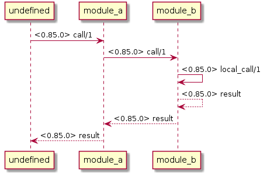

# cth_tracer - Tracing Hook for Common Test

This hook starts a tracer to monitor affected modules during a testcase run.

By default a collected sequence is formatted for [PlantUML](http://plantuml.com/sequence-diagram).

# Usage examples

See the directory `test` for details.


Example testcase trace:
```
@startuml

undefined -> module_a:<0.85.0> call/1
'arguments: [ping]
module_a -> module_b:<0.85.0> call/1
'arguments: [ping]
module_b -> module_b:<0.85.0> local_call/1
'arguments: [ping]
module_b <-- module_b:<0.85.0> result
'result: pong
module_a <-- module_b:<0.85.0> result
'result: pong
undefined <-- module_a:<0.85.0> result
'result: pong

@enduml
```

Thanks to [PlantUML](http://plantuml.com/sequence-diagram) for the awesome tool:


